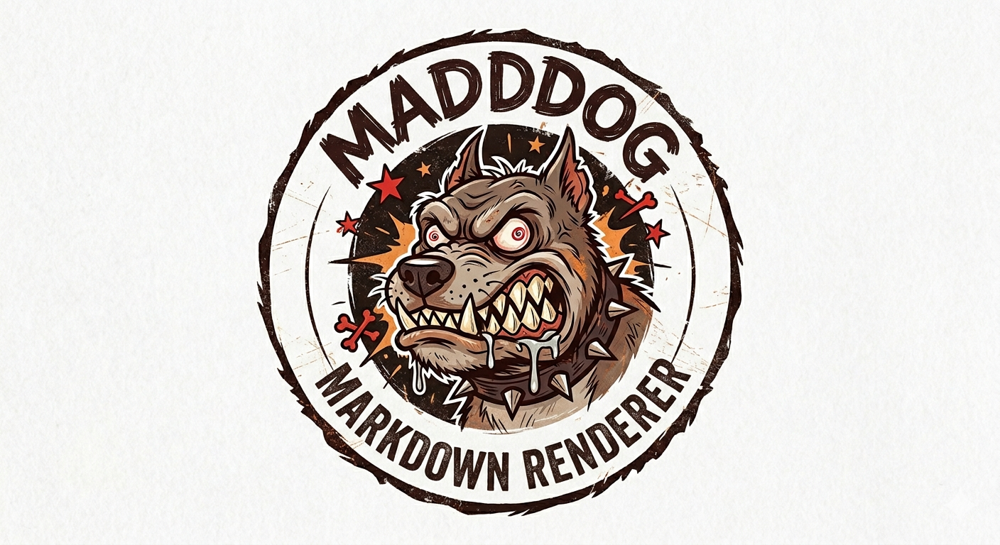

# MADDDOG A Markdown Renderer Integrated with External AI Models

MADDDOG is a specialized Markdown editor and renderer featuring integrated AI capabilities. It allows users to write Markdown, preview it in real-time, and leverage LLMs (Large Language Models) to generate content or refine documentation.

---

## Features
* **Live Preview:** Real-time rendering of Markdown into HTML using a split-pane interface.
* **AI-Powered Editing:** Built-in support for **llama-3.3-70b**, **llama-3.1-8b** (via Groq), and **Google Gemini**.
* **CLI Support:** Open files directly from the terminal.
* **State Management:** Track unsaved changes with "modified" indicators in the title bar.

---

## Installation & Requirements

### 1. Dependencies
The program requires Python 3 and the following libraries:
```bash
pip install requests markdown2 tkhtmlview

```

### 2. Environment Variables

To use the AI features, you must set the following API keys in your environment:

* `GROQ_API_KEY`: Required for Llama models.
* `GOOGLE_API_KEY`: Required for Gemini.

---

## Usage

### Launching the Program

Run the script via Python. You can optionally pass a file path to open it immediately:

```bash
python madddog [filename.md]

```

### The Interface

1. **Top Menu:** Standard file operations (Open, Save, Reset) and model selection.
2. **Left Top Pane (Editor):** Input your Markdown or AI prompts here.
3. **Left Bottom Pane (AI Response):** Displays the output generated by the selected AI model.
4. **Right Pane (Preview):** Shows the rendered HTML version of your Markdown.

### Working with AI

1. Navigate to the **Run model** menu.
2. Select a model (e.g., `llama-3.3-70b-versatile`).
3. Type your request in the top-left editor.
4. Click the **⇧ Put your prompt here ⇧** button.
5. The AI response will appear below and automatically render in the preview pane.

---

## Menu Commands

| Menu | Command | Description |
| --- | --- | --- |
| **File** | Open File | Loads a `.md` or `.txt` file into the editor. |
|  | Save | Saves changes to the current file (or triggers "Save As"). |
|  | Reset | Clears all panes and returns to the welcome screen. |
| **Run model** | Llama / Gemini | Switches the editor mode to the specific AI provider. |
| **Help** | README | Displays the local `README.md` file in the editor. |
|  | About | Shows version information. |

---

## Technical Details

* **Markdown Engine:** `markdown2` with `fenced-code-blocks` and `tables` extras enabled.
* **Threading:** AI API calls are handled in a background thread to prevent the UI from freezing during requests.
* **Debouncing:** The renderer waits 250ms after the last keystroke before updating the preview to ensure smooth performance.
''')

## Known Issues

**Note:** Markdown support may vary depending on the platform being used. These examples may not render correctly in all environments.
